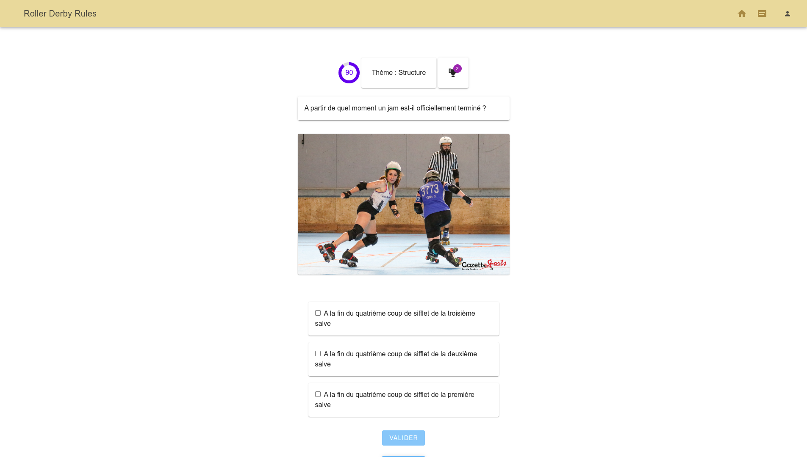
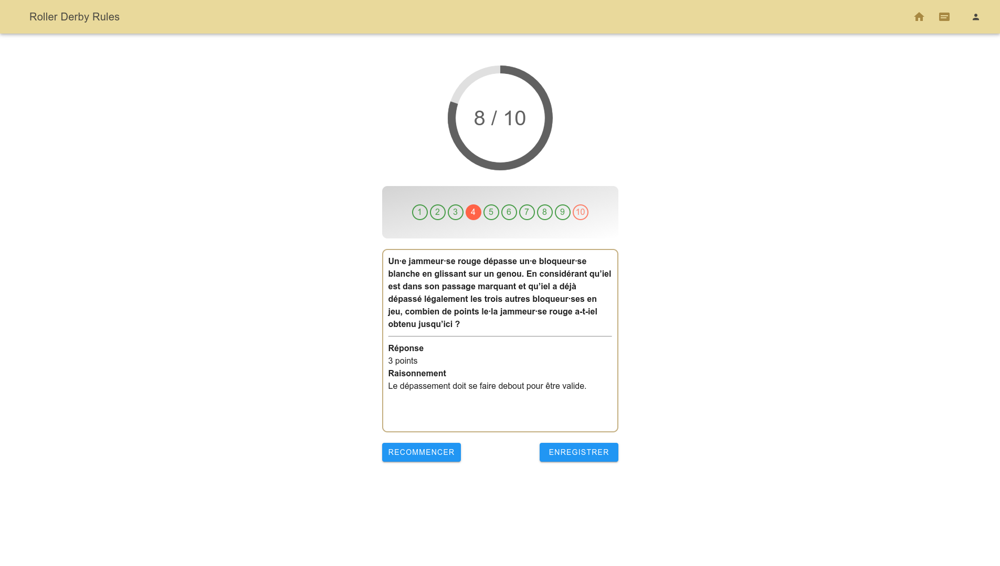
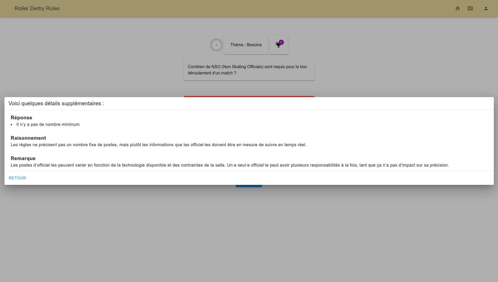

# Group project: quiz application

This is a **group project** I, alongside three other student developers, **built from scratch** during my Continuing Education course at **Toulouse Institute of Technology**.

This quiz application is designed to **help learn the rules of roller derby**, a fast-paced, highly strategical team sport I have been playing competitively for nearly ten years. It was **my idea to build this project**.

## Technologies

- **Node.js**: Express, Feathers, CORS, Knex
- **Vue.js** 3, Vuetify
- **PostgreSQL**

## Skills

### Project management

- **Develop an entire application as a team**
- Manage a project using **Agile methodology**
- Design the product with **wireframes** and **mockups** on **Figma**
- **Design a database** using **UML diagrams**
- **Set up and manage** a project with **git**

### Back-end

- Create a **REST API**
- Write **SQL queries** with the **Knex** library
- Use **Feathers** to **authenticate users**

### Front-end

- Create a **single page application** using **Vue.js** and **Vite**
- Handle **user inputs** with the **v-model** directive
- Respond to and handle user events with **event handlers**
- Use **computed properties** to iterate through arrays and objects
- Use **lifecycle hooks** to run code at specific stages
- **Style** the app with **Vuetify**

## Functionalities

- **Answer unlimited random questions** about the rules of roller derby
- **Show the answer on the fly**
- Use the **filter options** to **target specific rule chapters**
- Generate **a mock Minimum Skills test**
- See your **test results** on an **assessment page**
- Create an **account and log in**

## My own contributions to the project

- **"page_score" component**: an **assessment page calculating the user's score** ("comp_score" component) after a test and **displaying the answer to each question** thanks to a **hot reload functionality** ("comp_correction" component)

- **"comp_explications" component**: a **modal box showing the answer** to the current question as well as explanations during a quiz session

